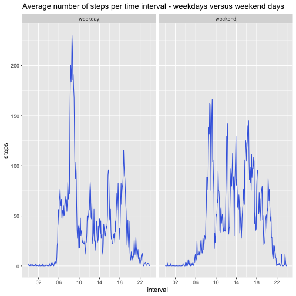

Peer review assignment 1 - Reproducible Research (Coursera)
-----------------------------------------------------------

Libraries that are needed are as follows:

```r
library(dplyr)
library(ggplot2)
library(lubridate)
```

## Opening and tidying the data.
Open activity.zip and read the csv, explore the data.

```r
csv <- unzip('activity.zip')
df <- read.csv(csv)
head(df)
```

```
##   steps       date interval
## 1    NA 2012-10-01        0
## 2    NA 2012-10-01        5
## 3    NA 2012-10-01       10
## 4    NA 2012-10-01       15
## 5    NA 2012-10-01       20
## 6    NA 2012-10-01       25
```

```r
dim(df)
```

```
## [1] 17568     3
```

```r
str(df)
```

```
## 'data.frame':	17568 obs. of  3 variables:
##  $ steps   : int  NA NA NA NA NA NA NA NA NA NA ...
##  $ date    : chr  "2012-10-01" "2012-10-01" "2012-10-01" "2012-10-01" ...
##  $ interval: int  0 5 10 15 20 25 30 35 40 45 ...
```

Put the date variable in a date format, and time in a POSIXct format.

```r
df$date <- as.Date(df$date)
df$interval <- as.POSIXct(sprintf("%04d",df$interval), format="%H%M") 
str(df)
```

```
## 'data.frame':	17568 obs. of  3 variables:
##  $ steps   : int  NA NA NA NA NA NA NA NA NA NA ...
##  $ date    : Date, format: "2012-10-01" "2012-10-01" "2012-10-01" "2012-10-01" ...
##  $ interval: POSIXct, format: "2020-09-23 00:00:00" "2020-09-23 00:05:00" "2020-09-23 00:10:00" "2020-09-23 00:15:00" ...
```

## Number of steps per day.
We calculate the total number of steps per day.

```r
df_day <- df %>% group_by(date) %>% 
    summarise(sum(steps, na.rm = TRUE), .groups='drop')
df_day$steps <- df_day$`sum(steps, na.rm = TRUE)`
```

Plot the total number of steps per day with a ggplot histogram.

```r
ggplot(df_day) +
    geom_bar(aes(date, steps), stat = 'identity', position='identity', fill = 'royalblue')
```


Calculate the mean and median steps per day:

```r
mean <- round(mean(df_day$steps, na.rm = TRUE), digits = 0)
median <- round(median(df_day$steps, na.rm = TRUE), digits = 0)
```
The mean number of steps per day is 9354 and the median number of steps per day is 10395.

## Number of steps per time interval.
First, we calculate the average number of steps per time interval.

```r
df_time <- df %>% group_by(interval) %>% 
    summarise(mean(steps, na.rm = TRUE), .groups='drop')
df_time$steps <- df_time$`mean(steps, na.rm = TRUE)`
head(df_time)
```

```
## # A tibble: 6 x 3
##   interval            `mean(steps, na.rm = TRUE)`  steps
##   <dttm>                                    <dbl>  <dbl>
## 1 2020-09-23 00:00:00                      1.72   1.72  
## 2 2020-09-23 00:05:00                      0.340  0.340 
## 3 2020-09-23 00:10:00                      0.132  0.132 
## 4 2020-09-23 00:15:00                      0.151  0.151 
## 5 2020-09-23 00:20:00                      0.0755 0.0755
## 6 2020-09-23 00:25:00                      2.09   2.09
```

Time series plot for the average number of steps per time interval:

```r
ggplot(df_time) +
    geom_line(aes(interval, steps), color = 'royalblue') +
    scale_x_datetime(date_label = "%H", date_breaks = "1 hour") +
    labs(title='Average number of steps per time interval')
```


What is the time interval with the most average steps?

```r
begin <- format(df_time$interval[which(df_time$steps==max(df_time$steps, na.rm = TRUE))], format = "%H:%M")
end <- format(df_time$interval[which(df_time$steps==max(df_time$steps, na.rm = TRUE))]+(5*60), format = "%H:%M")
```
The time interval between 08:35 and 08:40 has the most average steps.

## Imputing the missing values
First, we calculate the number of missing values in this data set.

```r
missings <- sum(is.na.data.frame(df))
```
There are 2304 missing values in the data set.

Now we explore where the values are missing - per time interval and per date.

```r
df_missing <- df[is.na(df$steps),]
ggplot(df_missing) +
    geom_bar(aes(date))
```


The missing values originate from 8 dates that miss all 288 values.

Imputing missing values with mean for the associated time interval:

```r
df_imp <- df
for (a in which(is.na(df_imp$steps))) {
    int <- format(df_imp$interval[a], format="%Y-%m-%d %H:%M:%S")
    mean_int <- mean(df_imp$steps[which(df_imp$interval == int)], na.rm=TRUE)
    df_imp$steps[a] <- mean_int
}
missings_imp <- sum(is.na.data.frame(df_imp)) # Checking if there are missings left
print(ifelse(missings_imp==0, 'There are no missing values left', 'There are missing values left'))
```

```
## [1] "There are no missing values left"
```
Now we can calculate the new total steps per day, and plot the number of steps.

```r
df_day2 <- df_imp %>% group_by(date) %>% 
    summarise(sum(steps, na.rm = TRUE), .groups='drop')
df_day2$steps <- df_day2$`sum(steps, na.rm = TRUE)`

ggplot(df_day2) +
    geom_bar(aes(date, steps), stat = 'identity', position='identity', fill = 'royalblue')
```


Calculating the new mean and median for the imputed data set:

```r
mean_imp <- round(mean(df_day2$steps, na.rm = TRUE), digits = 0)
median_imp <- round(median(df_day2$steps, na.rm = TRUE), digits = 0)
```
The mean was 9354 and became 10766 after imputing; the median was 10395 and became 10766 after imputing.

## Differences between week and weekend days
To examine the differences between weekdays and weekend days, we make a new factor variable 'week'.

```r
df_imp$week <- ifelse(weekdays(df_imp$date)=='zaterdag' |weekdays(df_imp$date)=='zondag', 'weekend', 'weekday')
df_imp$week <- as.factor(df_imp$week)
summary(df_imp$week)
```

```
## weekday weekend 
##   12960    4608
```

And calculate the averages over time intervals for weekdays and weekend days separately.

```r
df_time2 <- df_imp %>% group_by(interval, week) %>% 
    summarise(mean(steps, na.rm = TRUE), .groups='drop')
df_time2$steps <- df_time2$`mean(steps, na.rm = TRUE)`
head(df_time2)
```

```
## # A tibble: 6 x 4
##   interval            week    `mean(steps, na.rm = TRUE)`  steps
##   <dttm>              <fct>                         <dbl>  <dbl>
## 1 2020-09-23 00:00:00 weekday                      2.25   2.25  
## 2 2020-09-23 00:00:00 weekend                      0.215  0.215 
## 3 2020-09-23 00:05:00 weekday                      0.445  0.445 
## 4 2020-09-23 00:05:00 weekend                      0.0425 0.0425
## 5 2020-09-23 00:10:00 weekday                      0.173  0.173 
## 6 2020-09-23 00:10:00 weekend                      0.0165 0.0165
```

Finally, we plot the average steps in time series plots for weekdays vs weekend days.

```r
ggplot(df_time2) +
    geom_line(aes(interval, steps), color = 'royalblue') +
    scale_x_datetime(date_label = "%H", date_breaks = "4 hours") +
    facet_wrap(~week) +
    labs(title='Average number of steps per time interval - weekdays versus weekend days')
```


